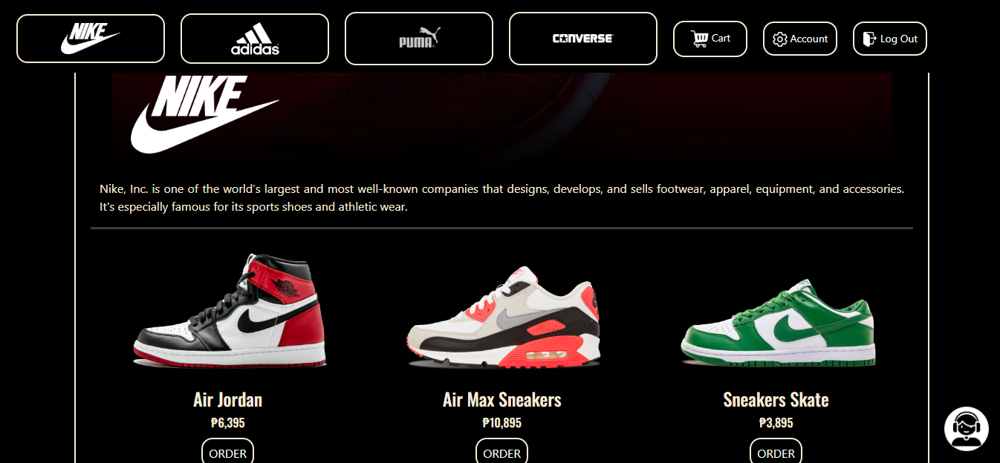
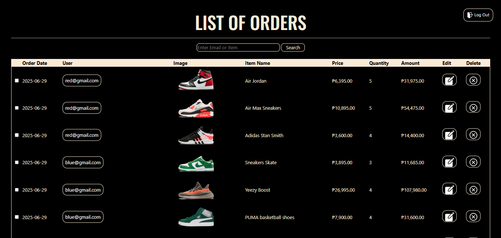

# VORO
A modern and sleek e-commerce retail platform built with PHP, CSS, and MySQL. It specializes in sports shoes from globally recognized brands like **Nike, Adidas, Puma, and Converse**. The platform provides a seamless shopping experience for users while offering powerful tools for administrators to manage products, orders, and customer data.

## Features
- **User Side**
    - **Product Catalog**: Browse shoes from Nike, Adidas, Puma, and Converse.
    - **User Account System**: Register, log in, and manage personal accounts.
    - **Order Shoes**: Add items to cart, checkout, and place orders.
    - **AI Support Assistant**: Provides answers to the most frequently asked questions (FAQ).
- **Admin Side**
    - **Order Management**: Edit, delete, and update orders.
    - **Data Visualization Dashboard**: See which products sell the most, Track items sold per day, Identify the top customers, and View the total amount spent by each user.

## Preview

  
  
  
  
  
  
  
  

